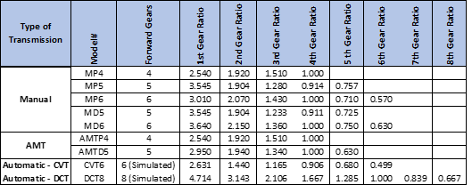

## Practice Statement - World of Vehicles 

**A leading vehicle manufacturer, Lukxtech, has organised a competition to help select the design of its next generation remote vehicle monitoring system. The company manufactures a range of passenger cars based on different engines and transmission configurations. To win the competition, participants have to create a design that will cater to different models of the cars manufactured by the company. As one of the  competitors of this design competition, you need to create a proof-of-concept prototype to demonstrate the power of your design.**

### Challenge – Part 2
In order to harness the power of an engine and transmit it to the wheels smoothly, a vehicle needs a transmission. The transmission allows the engine to operate at its optimal speed (in rpm) to ensure fuel efficiency and minimal emissions while allowing the driver to operate the vehicle at the desired speed (in kmph). While modern transmissions can be very complex, they essentially contain a set of gears or equivalent mechanical devices that allow the rotational speed and power of the engine to be transmitted to the wheels.

Lukxtech has developed a number of transmissions to suit the different types of passenger vehicles and the variety of engines that it produces. Affordable entry level cars are typically fitted with manual transmissions while the more expensive cars have automatic transmissions. Automated Manual Transmission (AMT) is a category they have introduced between the entry level and the expensive cars. Furthermore, there are multiple types of automated transmissions that have been developed by the automobile industry – torque converters, Continuously Variable Transmissions (CVT), and Dual-Clutch Transmissions (DCT). Lukxtech offers 6-speed CVT’s as well as 8-speed DCT’s. 
The full range of transmissions offered by Lukxtech, along with their specifications, is shown in Table 2 below.

**Task 1 –**

Analyze the family of car transmissions produced by Lukxtech and create an appropriate hierarchy of classes that can be used to model the transmissions. Let the parent class in the family be named Transmission. You have to determine the other child classes in this family based on the description of the family of Lukxtech transmissions described above and the information presented in Table 2. Create appropriate constructors for each of the classes identified by you so that transmission objects of various types can be instantiated as per the specifications in the table given above. The constructor should take a transmission model number as a parameter and initialize all the relevant specifications for that transmission type as per the specifications given in Table 2.

**Task 2 –**

Write a method named showSpecs() that can be invoked for any transmission type to display the specifications of a particular transmission object. The transmission specifications should be displayed as follows:

            Transmission Type:               <Type of Transmission>			
            Transmission Model Number:       <Transmission Model #>

Key Specifications:

            <Specification Name 1>		<Specification Value>
            <Specification Name 2>		<Specification Value>
            …
For example, an object that is an AMT D5 model will have the specifications displayed as:

            Transmission Type: 			Automated Manual		 
            Transmission Model Number:		AMTD5

            Key Specifications:
            1.	Forward Gears:			5
            2.	1st Gear Ratio:			2.950		
            3.	2nd Gear Ratio:			1.940
            4.	3rd Gear Ratio:			1.340
            5.	4th Gear Ratio:			1.000
            6.	5th Gear Ratio:			0.630

**Task 3 –**

Write a main() method to test the class hierarchy by declaring various kinds of transmission objects and showing their specifications.

